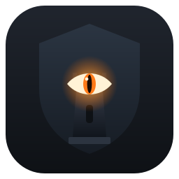

<p align="center">
  
</p>

<h1 align="center">Sentinelle</h1>

<p align="center">
  <strong>Multi-site video-surveillance viewer for RTSP / ONVIF cameras and DVRs.</strong><br/>
  Grid & single-camera views, ONVIF motion detection, bandwidth-aware streaming —<br/>
  standalone, or backed by a central server with user accounts and per-camera access.
</p>

<p align="center">
  <a href="https://github.com/Arcneell/sentinelle/releases"></a>
  
  
  <a href="LICENSE"></a>
</p>

---

Sentinelle turns a workstation into a video wall for RTSP / ONVIF cameras and DVRs. It
works with **Hikvision** and **Dahua** natively, several other brands via URL templates,
and any **ONVIF** device through auto-discovery — with per-camera bandwidth profiles so
large grids stay usable even over slow 4G links.

## Highlights

- 🧱 **Grid (up to 4×4) and single-camera views** — double-click any tile to switch.
- 🚨 **ONVIF motion detection** — moving tiles are outlined in red, and a *motion view*
  fills the grid live with only the cameras that are currently active.
- 📉 **Bandwidth profiles** — pick main/substream/snapshot per view; off-screen cameras
  hold no connection and nothing is transcoded.
- 🔭 **Wide device support + network discovery** — scan the LAN, tick cameras, and stream
  URLs, snapshot URLs and PTZ capability are resolved automatically.
- 🎮 **PTZ control** and digital zoom, per-tile aspect mode, multi-monitor full screen.
- 🔁 **Rotation & loops** — ordered sequences of views played on repeat, with an editor.
- 🖥️ **Optional central server** — shared configuration, user accounts with per-camera
  access, and a stream relay that pulls each camera **once** regardless of viewer count.

## Deployment modes

Choose per workstation at first launch. The mode is then locked — switching it, or the
server address, requires an admin account to sign in on that workstation.

|                         | **Standalone** (default)          | **Central server**                              |
| ----------------------- | --------------------------------- | ----------------------------------------------- |
| Extra infrastructure    | none                              | one Docker host (VM / NAS / mini-PC)            |
| Configuration           | local to each workstation         | centralised — add a camera once, everyone sees it |
| DVR credentials         | on each workstation               | **never leave the server** (clients get a token) |
| Access control          | —                                 | per-user sites/cameras, enforced server-side *and* at the relay |
| Bandwidth to sites      | one pull per viewer               | **one pull per camera**, only while watched (key for 4G) |
| Admin                   | —                                 | in-app Administration panel (users, cameras, loops) |

See [Server](#central-server) below for deployment.

## Quick start

Requires **Python 3.11+** and **libmpv**.

- Windows: put `libmpv-2.dll` in a `lib/` folder at the project root.
- Debian/Ubuntu: `sudo apt install libmpv2 libxcb-cursor0 va-driver-all` — Fedora: `sudo dnf install mpv-libs xcb-util-cursor libva-utils`.
  (`libxcb-cursor0` is needed by Qt's X11 backend, used for video embedding — including under Wayland via XWayland; `va-driver-all` enables **hardware video decoding** (VA-API), which is what lets low-power mini-PCs run many streams without saturating the CPU.)
- Optional: `ffprobe` (from `ffmpeg`) improves failure diagnostics.

```bash
pip install -r requirements.txt
python run.py
```

The Configuration window opens on first run.

> **Prefer a package?** Pre-built Linux `.deb` files are attached to every
> [release](https://github.com/Arcneell/sentinelle/releases):
> `sudo apt install ./sentinelle_<version>_amd64.deb` — this is the supported install
> path: it pulls `libmpv2`, the Qt/xcb libraries, the VA-API drivers (hard
> dependencies) and `ffmpeg` (recommended, better failure diagnostics).
> Plain `dpkg -i` does not resolve dependencies; if you use it, follow up with
> `apt -f install`.

## Configuration

Managed entirely in the UI: add a site (fiber or 4G), add a DVR (address and
credentials, then channel discovery or a manual list), then tick the cameras to display.

Stored at `%APPDATA%\Sentinelle\config.yaml` (Windows) or
`~/.config/sentinelle/config.yaml` (Linux); a `config.yaml` next to the executable takes
priority. Passwords are obfuscated in the file, not encrypted — the key ships with the
app, so this only prevents casual reading. **Use a read-only DVR account.**

## Features in detail

### Motion detection (ONVIF)

Toggle **Mouvement** to subscribe to each camera's ONVIF event stream (PullPoint). When a
camera reports motion, its tile is outlined in red. Toggle **Vue mouvement** and the grid
stops showing your manual selection and instead shows, live, only the cameras currently
moving — a hands-off wall that surfaces activity across every site.

Requires ONVIF (and its motion rule) enabled on the device; a camera without an event
service is simply skipped. Motion clears on the camera's "off" event, or after a few
seconds without a new one.

### Bandwidth profiles

Only the stream requested from the DVR determines the bitrate — there is no transcoding,
and an off-screen camera holds no connection.

| Profile     | Grid                           | Single           |
| ----------- | ------------------------------ | ---------------- |
| Normal      | substream                      | mainstream (HD)  |
| Eco         | substream                      | substream        |
| Extreme eco | JPEG snapshot every N seconds  | substream        |

Rotation and loops close the current streams before opening the next. RTSP runs over TCP.
Rendering favours **robustness over sharpness**: on Linux, video is decoded in **hardware**
(VA-API) and rendered in software (no OpenGL) — this runs on any hardware, including the
low-power fanless mini-PCs used as video walls, whose GPU drivers often crash mpv's OpenGL
path. Set `SENTINELLE_MPV_VO` / `SENTINELLE_MPV_HWDEC` to override per machine.

### Device support

Hikvision, Dahua, Amcrest, Reolink, Uniview, Axis, Vivotek, Foscam and TP-Link/Tapo via
built-in URL templates, plus **ONVIF** for anything else. ONVIF network discovery scans
the LAN and resolves each camera's stream URLs (main + sub), snapshot URL and PTZ
capability. Whole-DVR import discovers channels and their names over the Hikvision ISAPI,
or lists them manually for other brands.

Reconnection uses exponential backoff, and retries stop on an authentication failure to
avoid locking the DVR account.

## Central server

The server is two containers: a FastAPI control plane and a
[MediaMTX](https://github.com/bluenviron/mediamtx) stream relay. Streams are proxied **on
demand** with no re-encoding (H.264 passthrough), so CPU usage stays negligible.

Deploy it on a Linux machine that can reach the DVRs and is reachable by the workstations.
Prerequisites: Docker with the Compose plugin
(`sudo apt install docker.io docker-compose-v2` on Debian/Ubuntu). Then, from a clone of
this repository:

```bash
cd deploy
docker compose up -d --build     # builds the API image and starts both containers
```

- On first start an **admin** account is created; its initial password is printed in the
  API logs (`docker compose logs api`) and written to `deploy/data/admin-initial.txt`. Log
  in with it, change it (*Configuration → Mon compte*), then delete that file.
- To bootstrap from an existing standalone installation, copy its `config.yaml` into
  `deploy/data/` before the first start — same file format.
- Manage everything from the app while logged in as admin → **Administration**: create
  users, grant each whole sites or individual cameras, edit cameras/sites, loops, settings.
- On each workstation: *Configuration → Connexion* → mode **Serveur central** and the
  server URL (`http://server:8080`), then log in. "Rester connecté" stores the credentials
  for unattended restart (use a dedicated viewer account on wall displays).
- **Ports**: `8080/tcp` (API — login, config, snapshots, PTZ, motion over SSE, relay
  auth) and `8554/tcp` (RTSP relay). The MediaMTX control port stays inside the Docker
  network.
- **Update**: `git pull && docker compose up -d --build`. After editing
  `deploy/mediamtx.yml`, recreate the relay so it reloads: `docker compose up -d
  --force-recreate mediamtx`.

**Security model.** Passwords are hashed with PBKDF2 (never stored or sent in clear)
with an 8-character minimum; sessions are stateless signed tokens that a password change
immediately invalidates and that **expire** after `SENTINELLE_TOKEN_TTL_H` hours (default
168 = 7 days — clients with "Rester connecté" refresh silently before expiry); repeated
failed logins from one IP are throttled (HTTP 429). Per-user camera access is enforced
both in the API and at the relay (MediaMTX external HTTP authorization calls back into the
API for every read, and external publishing to the relay is refused); DVR credentials live
only on the server.

The API speaks plain HTTP — deploy it on a trusted network (VPN), or terminate TLS with the
bundled Caddy overlay:

```bash
export SENTINELLE_DOMAIN=sentinelle.example.org   # or use `tls internal` — see deploy/Caddyfile
docker compose -f docker-compose.yml -f docker-compose.tls.yml up -d
```

`deploy/data/` holds all secrets and is gitignored.

## Building packages

Pre-built Linux packages are attached to each
[release](https://github.com/Arcneell/sentinelle/releases). To build them yourself:

```bash
# Linux .deb (works from Windows too, via Docker) -> dist/sentinelle_<version>_amd64.deb
# Build on the SAME Debian release as the target machines (Debian 13/trixie).
docker run --rm -v "${PWD}:/src" -w /src debian:13 bash packaging/build_deb.sh
```

```powershell
# Windows executable (PyInstaller) — builds dist/Sentinelle/Sentinelle.exe
pwsh packaging/build_windows.ps1
```

The script signs the executable when a code-signing certificate is provided
(`$env:SENTINELLE_PFX` / `$env:SENTINELLE_PFX_PW`) — **recommended**, as unsigned builds are
routinely blocked by endpoint protection (Symantec Endpoint Protection & co.). Without a
certificate it still builds, unsigned.

Installed `.deb`: launch **Sentinelle** from the applications menu or the `sentinelle`
command (Debian 13 / Ubuntu 24.04+). On a Wayland session (GNOME's default) the app
automatically requests XWayland (`QT_QPA_PLATFORM=xcb;wayland`, i.e. xcb with a wayland
fallback) so video renders — set that variable yourself only to override the
auto-detection. If it ends up on native Wayland (video unavailable), the app now says so
at startup. If the GPU driver makes video crash the machine, right-click the launcher
icon and pick **Safe video mode**, or run `sentinelle --safe-video`.

## Architecture

```
sentinelle/                  Desktop client (PySide6 / Qt 6)
├── config.py                Data model, brand URL templates, config.yaml read/write
├── probe.py                 RTSP failure classification (auth / timeout / network)
├── snapshot.py              JPEG snapshots (ISAPI/CGI) and Hikvision channel discovery
├── onvif.py                 ONVIF: WS-Discovery, stream/snapshot URIs, PTZ, motion events
├── motion.py                ONVIF motion monitor (per-camera event subscription threads)
├── player.py                libmpv loading, RTSP settings, VA-API HW decode
├── remote.py                Server mode: API client, session login, SSE motion listener
└── ui/                      Title bar, sidebar, grid/single views, tiles, dialogs, theme
sentinelle_server/           Server (no Qt dependency)
├── app.py                   FastAPI API: login, config, snapshots, PTZ, SSE, relay-auth
├── auth.py                  User accounts, PBKDF2 hashing, signed tokens, permissions
├── store.py                 Central config (same YAML format) + secret/bootstrap admin
├── relay.py                 MediaMTX orchestration (one on-demand path per stream)
└── motion.py                Server-side ONVIF motion monitor + event hub
deploy/                      docker-compose.yml, Dockerfile.server, mediamtx.yml
packaging/                   .deb build script, icon generation
```

ONVIF is implemented directly over SOAP/HTTP (WS-UsernameToken digest auth) — no
`zeep`/`onvif-zeep` dependency. Network discovery uses WS-Discovery multicast, which does
not cross VLAN/VPN boundaries; cameras on routed subnets are added by direct IP instead.
Each tile runs its own libmpv instance on a separate thread, so a failing stream never
affects the others.

## Tech stack

**Client** — Python 3.11+, [PySide6](https://doc.qt.io/qtforpython/) (Qt 6),
[python-mpv](https://github.com/jaseg/python-mpv), PyYAML, requests.
**Server** — FastAPI + uvicorn, [MediaMTX](https://github.com/bluenviron/mediamtx) (Docker).

## License

Released under the [MIT License](LICENSE).
