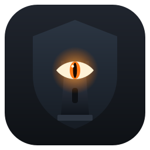

<p align="center">
  
</p>

<h1 align="center">Sentinelle</h1>

<p align="center">
  Mur d'images multi-sites pour caméras et enregistreurs RTSP / ONVIF.<br/>
  Client Qt autonome, ou adossé à un serveur central.
</p>

<p align="center">
  <a href="https://github.com/Arcneell/sentinelle/releases"></a>
  <a href="https://github.com/Arcneell/sentinelle/actions/workflows/ci.yml"></a>
  
  <a href="LICENSE"></a>
</p>

---

Sentinelle affiche les caméras de plusieurs sites sur un poste de travail. Hikvision et
Dahua sont gérés nativement, huit autres marques par gabarits d'URL, le reste en ONVIF.
Chaque caméra reçoit un profil de bande passante, ce qui rend une grille de 16 flux tenable
derrière un lien 4G.

## Fonctionnalités

- Grille jusqu'à 4×4 et plein écran, double-clic pour basculer.
- Détection de mouvement ONVIF : la tuile qui bouge est cerclée de rouge. La vue mouvement
  n'affiche que les caméras actives, en direct.
- Profils de bande passante : flux principal, flux secondaire ou vignette JPEG selon la vue.
- Découverte réseau ONVIF : un balayage résout les URL de flux, de vignette et le PTZ.
- PTZ, zoom numérique, plein écran multi-écrans.
- Rotations et boucles de vues, avec éditeur.
- Serveur central facultatif : configuration partagée, comptes, droits par caméra, une seule
  connexion par caméra quel que soit le nombre de spectateurs.

## Installation

Debian 13 ou Ubuntu 24.04+, avec le `.deb` joint à chaque
[version](https://github.com/Arcneell/sentinelle/releases) :

```bash
sudo apt install ./sentinelle_<version>_amd64.deb
```

`dpkg -i` ne résout pas les dépendances ; enchaîner avec `apt -f install` le cas échéant.

Depuis les sources, avec Python 3.11+ et libmpv :

```bash
# Debian/Ubuntu : sudo apt install libmpv2 libxcb-cursor0 va-driver-all
# Fedora        : sudo dnf install mpv-libs xcb-util-cursor libva-utils
# Windows       : placer libmpv-2.dll dans lib/
pip install -r requirements.txt
python run.py
```

`va-driver-all` fournit le décodage matériel VA-API, indispensable pour tenir beaucoup de
flux sur un mini-PC. `ffprobe` est facultatif et améliore le diagnostic des échecs.

## Configuration

Tout se fait dans l'interface : ajouter un site, un enregistreur, puis cocher les caméras.
Le fichier est écrit dans `%APPDATA%\Sentinelle\config.yaml` ou
`~/.config/sentinelle/config.yaml` ; un `config.yaml` posé à côté de l'exécutable a la
priorité.

Les mots de passe y sont obscurcis, pas chiffrés, avec une clé embarquée dans
l'application : utiliser un compte d'enregistreur en lecture seule.

## Profils de bande passante

| Profil      | Grille                       | Plein écran         |
| ----------- | ---------------------------- | ------------------- |
| Normal      | flux secondaire              | flux principal (HD) |
| Éco         | flux secondaire              | flux secondaire     |
| Éco extrême | vignette JPEG toutes les N s | flux secondaire     |

Rien n'est réencodé : seul le flux demandé à l'enregistreur détermine le débit. Une caméra
hors écran ne tient aucune connexion. Le RTSP passe en TCP.

Sous Linux, la vidéo est décodée en matériel (VA-API) puis rendue en logiciel, sans OpenGL.
C'est plus robuste sur les mini-PC fanless, dont les pilotes font souvent tomber le chemin
OpenGL de mpv. `SENTINELLE_MPV_VO` et `SENTINELLE_MPV_HWDEC` forcent un autre réglage.

## Serveur central

Deux conteneurs : une API FastAPI et un relais
[MediaMTX](https://github.com/bluenviron/mediamtx). Les flux sont relayés à la demande, en
H.264 passthrough. Les identifiants des enregistreurs restent sur le serveur, les postes
reçoivent un jeton.

```bash
cd deploy
docker compose up -d --build
```

Le mot de passe admin initial est écrit dans `deploy/data/admin-initial.txt` et dans les
journaux de l'API. Le reste s'administre depuis l'application : comptes, droits par site ou
par caméra, caméras, boucles. Sur chaque poste : *Configuration → Connexion*, mode serveur
central, puis l'URL du serveur.

Ports : `8080/tcp` pour l'API, `8554/tcp` pour le relais RTSP.

Déploiement détaillé, TLS, modèle de sécurité et lecture des flux par un service tiers :
[docs/serveur.md](docs/serveur.md).

## Construction des paquets

```bash
# .deb Debian 13, y compris depuis Windows -> dist/sentinelle_<version>_amd64.deb
docker run --rm -v "${PWD}:/src" -w /src debian:13 bash packaging/build_deb.sh
```

```powershell
# Exécutable Windows -> dist/Sentinelle/Sentinelle.exe
pwsh packaging/build_windows.ps1
```

Le script Windows signe le binaire si `$env:SENTINELLE_PFX` et `$env:SENTINELLE_PFX_PW` sont
fournis. Sans signature, les protections de poste bloquent souvent le résultat.

## Architecture

```
sentinelle/                Client de bureau (PySide6 / Qt 6)
├── config.py              Modèle de données, gabarits d'URL, config.yaml
├── probe.py               Classement des échecs RTSP (auth / délai / réseau)
├── snapshot.py            Vignettes JPEG, découverte des canaux Hikvision
├── onvif.py               WS-Discovery, URI de flux, PTZ, événements
├── motion.py              Moniteur de mouvement (un thread par caméra)
├── player.py              libmpv, réglages RTSP, décodage VA-API
├── remote.py              Mode serveur : client API, session, écoute SSE
└── ui/                    Vues, tuiles, dialogues, thème
sentinelle_server/         Serveur (sans Qt)
├── app.py                 API FastAPI, autorisation du relais
├── auth.py                Comptes, PBKDF2, jetons signés, droits
├── store.py               Configuration centrale, amorçage admin
├── relay.py               Orchestration MediaMTX
└── motion.py              Mouvement côté serveur, bus d'événements
deploy/                    docker-compose, Dockerfile, mediamtx.yml
packaging/                 Construction du .deb, icônes
```

L'ONVIF est implémenté directement sur SOAP/HTTP, sans `zeep`. La découverte utilise le
multicast WS-Discovery, qui ne franchit ni VLAN ni VPN : les caméras routées s'ajoutent par
IP. Chaque tuile a sa propre instance de libmpv sur son thread, donc un flux en échec
n'entraîne pas les autres.

## Contribuer

Voir [CONTRIBUTING.md](CONTRIBUTING.md) et le [code de conduite](CODE_OF_CONDUCT.md). Le
code, les commentaires et l'interface sont en français.

Pour une faille de sécurité, pas d'issue publique : [SECURITY.md](SECURITY.md).

## Licence

Logiciel libre sous [AGPL-3.0 ou ultérieure](LICENSE).
